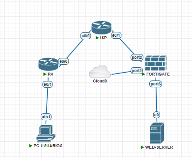
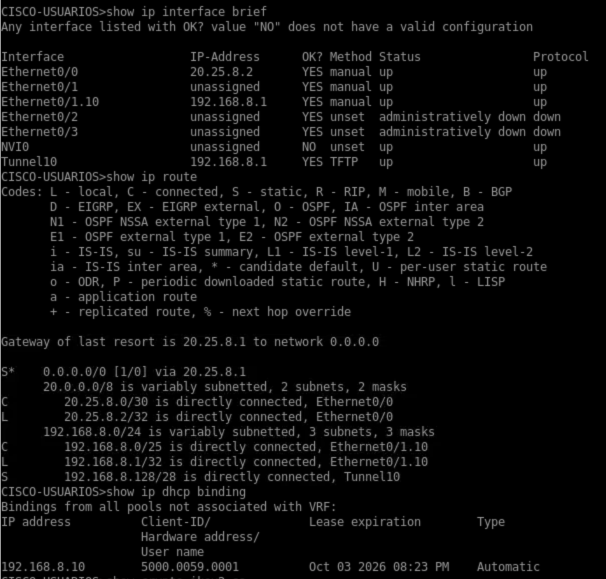
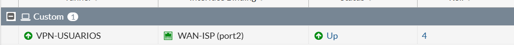
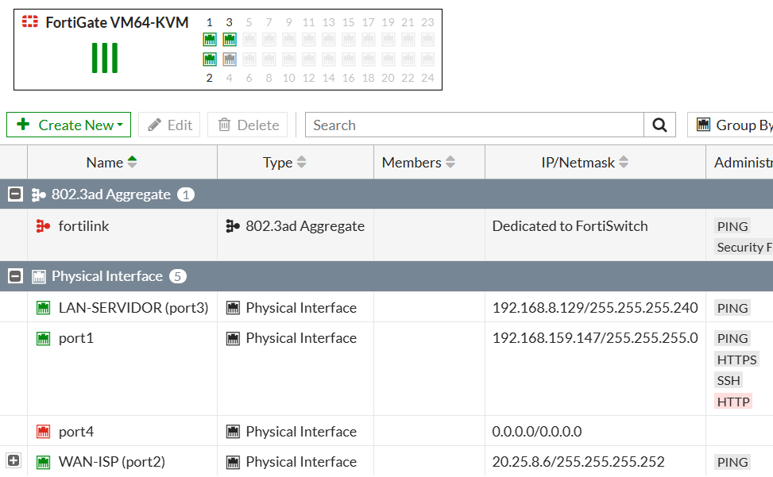
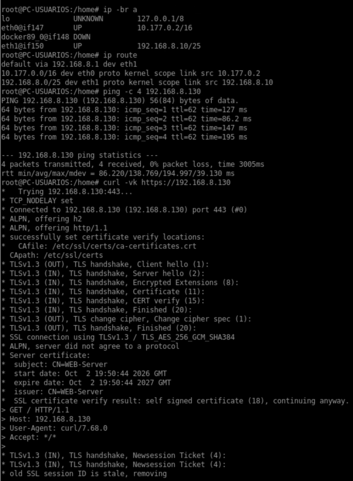

# Práctica 2 — Infraestructura 2
## VPN Site-to-Site: Cisco (Usuarios) ↔ ISP ↔ FortiGate (Servidor)

**Estudiante:** Aaron Hernandez  
**Matrícula:** 2025-0800  
**Curso:** Seguridad de Redes  
**Plataforma:** PNETLab  
**Fecha:** Octubre 2026

> **🎥 Video demostrativo:** https://youtu.be/6c059OMuvDA

---

## 1. Propósito del laboratorio
### Evidencia 01 — Topología final



Implementar y demostrar una VPN Site-to-Site entre un **router Cisco ubicado del lado de los usuarios** y un **FortiGate ubicado del lado del servidor web**, pasando por un ISP con direccionamiento público.

El laboratorio demuestra:

- Usuarios de **VLAN 10** obteniendo dirección IP mediante DHCP.
- Comunicación entre la red de usuarios `/25` y el servidor web `/28` mediante la VPN.
- Servicio Web sobre **HTTPS/443**.
- NAT para la salida hacia el segmento público.
- Tráfico entre las redes protegidas sin NAT.
- Interrupción de la comunicación cuando la VPN está caída.
- Recuperación de la comunicación cuando el túnel vuelve a estar activo.


---

## 2. Topología final

```text
                              ISP
                       ┌────────────────┐
                       │                │
             20.25.8.1/30      20.25.8.5/30
                       │                │
                       │                │
                Cisco-USUARIOS       FortiGate
                 20.25.8.2/30       20.25.8.6/30
                       │                │
                       │                │
                VLAN 10 /25        LAN-SERVIDOR /28
                       │                │
                  PC-Usuario       Web Server
                 192.168.8.x     192.168.8.130
                   DHCP              HTTPS
```

### Conexiones

| Desde | Puerto | Hacia | Puerto |
|---|---|---|---|
| PC-Usuario | eth1 | Cisco-USUARIOS | e0/1 |
| Cisco-USUARIOS | e0/0 | ISP | e0/0 |
| ISP | e0/1 | FortiGate | port2 |
| FortiGate | port3 | Web Server | eth0 |
| FortiGate | port1 | Cloud0 | — |

### Diagrama

INFRAESTRUCTURA 2
                    VPN SITE-TO-SITE IPsec
                              │
                              │
                    ┌─────────▼─────────┐
                    │    PC-USUARIO     │
                    │ 192.168.8.10/25  │
                    └─────────┬─────────┘
                              │
                              │
                    ┌─────────▼─────────┐
                    │  CISCO-USUARIOS   │
                    │    Gateway:       │
                    │   192.168.8.1     │
                    │                   │
                    │   WAN:            │
                    │ 20.25.8.2/30      │
                    └─────────┬─────────┘
                              │
                              │ 20.25.8.0/30
                              │
                    ┌─────────▼─────────┐
                    │       ISP         │
                    │                   │
                    │  Hacia Cisco:     │
                    │   20.25.8.1       │
                    │                   │
                    │  Hacia FortiGate: │
                    │   20.25.8.5       │
                    └─────────┬─────────┘
                              │
                              │ 20.25.8.4/30
                              │
                    ┌─────────▼─────────┐
                    │    FORTIGATE      │
                    │                   │
                    │  port2 (WAN):     │
                    │ 20.25.8.6/30      │
                    │                   │
                    │ port3 (LAN):      │
                    │192.168.8.129/28   │
                    └─────────┬─────────┘
                              │
                              │
                    ┌─────────▼─────────┐
                    │    WEB SERVER     │
                    │ 192.168.8.130/28  │
                    │ Gateway:          │
                    │ 192.168.8.129     │
                    │                   │
                    │       HTTPS       │
                    └───────────────────┘


        ╔══════════════════════════════════════════╗
        ║           TÚNEL VPN IPsec               ║
        ║                                          ║
        ║  CISCO-USUARIOS ◄════════════► FORTIGATE║
        ║     20.25.8.2              20.25.8.6    ║
        ╚══════════════════════════════════════════╝

Red de usuarios: 192.168.8.0/25
Red del servidor: 192.168.8.128/28

### Descripción del diagrama

La infraestructura está compuesta por una red de usuarios conectada al equipo CISCO-USUARIOS, el cual establece un túnel VPN IPsec hacia el FortiGate a través del ISP. El FortiGate conecta con el servidor web ubicado en la red `192.168.8.128/28`. La comunicación entre usuarios y servidor se realiza mediante el túnel VPN.

---

## 3. Direccionamiento basado en matrícula

| Segmento | Red | Uso |
|---|---|---|
| Usuarios VLAN 10 | `192.168.8.0/25` | Clientes DHCP |
| Servidor Web | `192.168.8.128/28` | HTTPS |
| ISP ↔ Cisco | `20.25.8.0/30` | Enlace público |
| ISP ↔ FortiGate | `20.25.8.4/30` | Enlace público |

| Equipo | Interfaz | Dirección |
|---|---|---|
| ISP | e0/0 | `20.25.8.1/30` |
| Cisco-USUARIOS | e0/0 | `20.25.8.2/30` |
| ISP | e0/1 | `20.25.8.5/30` |
| FortiGate | port2 | `20.25.8.6/30` |
| Cisco-USUARIOS | e0/1.10 | `192.168.8.1/25` |
| Web Server | eth0 | `192.168.8.130/28` |

**DHCP VLAN 10:** `192.168.8.10–192.168.8.100`  
**Gateway usuarios:** `192.168.8.1`  
**Gateway servidor:** `192.168.8.129`


---

## 4. ISP

### Configuración

```cisco
enable
configure terminal
hostname ISP
no ip domain-lookup

interface Ethernet0/0
 description CISCO-USUARIOS
 ip address 20.25.8.1 255.255.255.252
 no shutdown

interface Ethernet0/1
 description FORTIGATE-SERVIDOR
 ip address 20.25.8.5 255.255.255.252
 no shutdown

end
write memory
```

### Verificación

```cisco
show ip interface brief
show ip route
ping 20.25.8.2
ping 20.25.8.6
```


---

## 5. Cisco-USUARIOS
### Evidencia 02 — Cisco: interfaces, DHCP, routing y VPN



### 5.1 WAN, interfaz LAN y VLAN 10

```cisco
enable
configure terminal
hostname CISCO-USUARIOS
no ip domain-lookup

interface Ethernet0/0
 description WAN-ISP
 ip address 20.25.8.2 255.255.255.252
 ip nat outside
 no shutdown

interface Ethernet0/1
 no ip address
 no shutdown

interface Ethernet0/1.10
 description VLAN10-USUARIOS
 encapsulation dot1Q 10 native
 ip address 192.168.8.1 255.255.255.128
 ip nat inside
 no shutdown
```

### 5.2 DHCP

```cisco
ip dhcp excluded-address 192.168.8.1 192.168.8.9
ip dhcp excluded-address 192.168.8.101 192.168.8.126

ip dhcp pool VLAN10-USUARIOS
 network 192.168.8.0 255.255.255.128
 default-router 192.168.8.1
```

### 5.3 Routing

```cisco
ip route 0.0.0.0 0.0.0.0 20.25.8.1
ip route 192.168.8.128 255.255.255.240 Tunnel10
```

### 5.4 NAT

```cisco
ip access-list extended NAT-INTERNET
 deny ip 192.168.8.0 0.0.0.127 192.168.8.128 0.0.0.15
 permit ip 192.168.8.0 0.0.0.127 any

ip nat inside source list NAT-INTERNET interface Ethernet0/0 overload
```

### 5.5 VPN IKEv2 + VTI

```cisco
crypto ikev2 proposal PROP-FGT
 encryption des
 integrity sha256
 group 14

crypto ikev2 policy POL-FGT
 proposal PROP-FGT

crypto ikev2 keyring KEY-FGT
 peer FORTIGATE
  address 20.25.8.6
  pre-shared-key <REDACTED>

crypto ikev2 profile PROF-FGT
 match identity remote address 20.25.8.6 255.255.255.255
 authentication remote pre-share
 authentication local pre-share
 keyring local KEY-FGT

crypto ipsec transform-set TS-FGT esp-des esp-sha256-hmac
 mode tunnel

crypto ipsec profile IPSEC-PROF-FGT
 set transform-set TS-FGT
 set pfs group14
 set ikev2-profile PROF-FGT

interface Tunnel10
 ip unnumbered Ethernet0/1.10
 tunnel source Ethernet0/0
 tunnel mode ipsec ipv4
 tunnel destination 20.25.8.6
 tunnel protection ipsec profile IPSEC-PROF-FGT
```

### Verificación

```cisco
show ip interface brief
show ip route
show ip dhcp binding
show ip dhcp pool
show ip nat translations
show crypto ikev2 sa
show crypto ipsec sa
show crypto map
```


---

## 6. FortiGate

> La configuración del FortiGate se realizó principalmente por GUI. La consola se utilizó únicamente para el acceso inicial.

### 6.1 Acceso inicial por consola

```text
config system global
set admin-https-redirect disable
end

config system interface
edit port1
set mode dhcp
set defaultgw disable
set allowaccess ping http https ssh
next
end

get system interface physical
```


### 6.2 `port2` — WAN

**GUI:** `Network → Interfaces → port2 → Edit`

```text
IP: 20.25.8.6/30
Alias: WAN-ISP
Role: WAN
Administrative Access: PING
Status: Enabled
```


### 6.3 `port3` — LAN servidor

**GUI:** `Network → Interfaces → port3 → Edit`

```text
IP: 192.168.8.129/28
Alias: LAN-SERVIDOR
Role: LAN
Administrative Access: PING
Status: Enabled
```


### 6.4 Ruta por defecto

**GUI:** `Network → Static Routes → Create New`

```text
Destination: 0.0.0.0/0
Gateway: 20.25.8.5
Interface: port2
```


### 6.5 VPN
### Evidencia 04 — VPN activa



**GUI:** `VPN → IPsec Tunnels → VPN-USUARIOS → Edit`

```text
Remote Gateway: 20.25.8.2
Outgoing Interface: port2
PSK: <REDACTED>
```

Los objetos creados por el wizard representan:

```text
VPN-USUARIOS_local  = 192.168.8.128/28
VPN-USUARIOS_remote = 192.168.8.0/25
```

Phase 1:

```text
IKE Version: IKEv2
Encryption: DES
Integrity: SHA256
DH Group: 14
```

Phase 2:

```text
Local Address: all
Remote Address: all
Encryption: DES
Authentication: SHA256
PFS: Enabled
DH Group: 14
```


### 6.6 Policy & Routing del wizard

```text
Local Interface: LAN-SERVIDOR
Local Subnets: 192.168.8.128/28
Remote Subnets: 192.168.8.0/25
Internet Access: None
```

El wizard dejó:

```text
192.168.8.0/25 → VPN-USUARIOS
192.168.8.0/25 → Blackhole (Distance 254)
```


### 6.7 NAT del servidor
### Evidencia 03 — FortiGate: interfaces y routing



**GUI:** `Policy & Objects → Firewall Policy`

```text
Name: SERVIDOR-a-INTERNET
Incoming Interface: LAN-SERVIDOR
Outgoing Interface: port2
Source: all
Destination: all
Service: ALL
Action: ACCEPT
NAT: ON
```


---

## 7. Web Server HTTPS

### Direccionamiento

```bash
ip addr flush dev eth0
ip addr add 192.168.8.130/28 dev eth0
ip link set eth0 up
ip route replace default via 192.168.8.129
```

### Certificado

```bash
openssl req -x509 -newkey rsa:2048 -nodes \
-keyout /root/key.pem \
-out /root/cert.pem \
-days 365 \
-subj "/CN=WEB-Server"
```

### Página web

```bash
mkdir -p /var/www/html

echo "<h1>WEB-Server HTTPS - Aaron Hernandez - 2025-0800 - Infraestructura 2</h1>" \
> /var/www/html/index.html
```

### Servicio HTTPS

```bash
cat > /root/https_server.py <<'PY'
import http.server
import ssl
server = http.server.HTTPServer(("0.0.0.0", 443), http.server.SimpleHTTPRequestHandler)
context = ssl.SSLContext(ssl.PROTOCOL_TLS_SERVER)
context.load_cert_chain("/root/cert.pem", "/root/key.pem")
server.socket = context.wrap_socket(server.socket, server_side=True)
server.serve_forever()
PY

cd /var/www/html
nohup python3 /root/https_server.py >/root/https.log 2>&1 &
```

### Verificación

```bash
ip -br a
ip route
ss -tlnp | grep 443
```


---

## 8. PC-Usuario

```bash
ip link set eth1 up
dhclient -v eth1
ip -br a
ip route
```

Resultado esperado:

```text
eth1 = 192.168.8.10/25
Default gateway = 192.168.8.1
```


---

## 9. Pruebas de funcionamiento
### Evidencia 05 — Pruebas de conectividad y HTTPS



### Conectividad local

```bash
ping -c 3 192.168.8.1
```

### Segmento público

```bash
ping -c 3 20.25.8.1
```

### Servidor por VPN

```bash
ping -c 4 192.168.8.130
```

### HTTPS

```bash
curl -vk https://192.168.8.130
```


---

## 10. Traceroute mediante TTL creciente

La imagen Docker utilizada no permitió instalar `traceroute`. La prueba utilizada fue TTL creciente:

```bash
echo "TRACEROUTE - TTL CRECIENTE"

for t in 1 2 3 4
do
    echo "TTL $t"
    ping -c 1 -W 2 -t $t 192.168.8.130 | grep -E "From|bytes from"
done
```


---

## 11. Verificación de VPN

### Cisco

```cisco
show crypto ikev2 sa
show crypto ipsec sa
```

### FortiGate

**GUI:** `VPN → IPsec Tunnels`

El túnel `VPN-USUARIOS` debe aparecer **UP**.


---

## 12. Prueba de seguridad con VPN caída

1. En FortiGate: `VPN → IPsec Tunnels → VPN-USUARIOS → Bring Down`.
2. Desde el PC:

```bash
ping -c 4 192.168.8.130
curl -vk --max-time 5 https://192.168.8.130
```

Las pruebas deben fallar.

3. Volver a activar el túnel.
4. Repetir:

```bash
ping -c 4 192.168.8.130
curl -vk https://192.168.8.130
```


---

# 13. Running-Configs


## ISP

Archivo completo: [`running-configs/ISP.txt`](running-configs/ISP.txt)

## CISCO-USUARIOS

Archivo completo: [`running-configs/CISCO-USUARIOS.txt`](running-configs/CISCO-USUARIOS.txt)

## FortiGate

Archivo completo: [`running-configs/FW-SERVIDOR.conf`](running-configs/FW-SERVIDOR.conf)

El export contiene, entre otros elementos, las interfaces `port2 = 20.25.8.6/30`, `port3 = 192.168.8.129/28`, el túnel `VPN-USUARIOS`, la ruta por defecto, la ruta VPN y la blackhole. El backup original fue sanitizado antes de colocarlo en esta estructura.

---

# 15. Archivos de comandos

Archivo consolidado: [`scripts/comandos-laboratorio.txt`](scripts/comandos-laboratorio.txt)

Contiene los comandos de configuración y verificación de:

- FortiGate (acceso inicial por consola).
- ISP.
- Cisco-USUARIOS.
- Web Server.
- PC-Usuario.
- Pruebas de conectividad, HTTPS y VPN.
- Traceroute mediante TTL creciente.

---

# 16. Conclusión

La Infraestructura 2 implementa una VPN Site-to-Site entre el router Cisco del lado de usuarios y el FortiGate del lado del servidor, utilizando el direccionamiento basado en la matrícula `2025-0800`. Se integran VLAN 10, DHCP, NAT, servidor web HTTPS y pruebas de operación con la VPN activa y caída.
